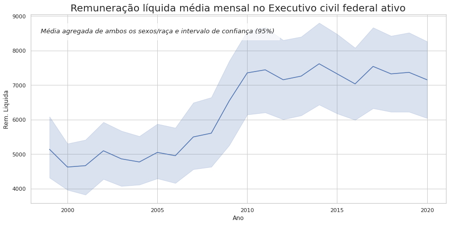

# Hacker de fiscalização e Análise de Dados

## Reprodutibilidade

O notebook criado está em um ambiente de desenvolvimento local. Para reproduzir os códigos, basta instalar os pacotes listados no arquivo requirements.txt com o código:

```
pip install -r requirements.txt
```
## Análise
### Inferências

Os dados obtidos continham informações da remununeração média líquida dos servidores do executivo civil federal, distribuídos em 4 categorias

- Homem Branco
- Homem Negro
- Mulher Branca
- Mulher Negra

A partir dos dados obtidos, é possível observar que a remuneração média líquida dos servidores saiu de uma base em torno de R$ 5.000,00 na década de 2000 para R$ 7.500,00 na década de 2010. Isso mostra um crescimento na remuneração média de em torno de 50% no período.




Porém, é evidente que esse crescimento não é igualmente distribuído. Para homens, a remuneração média no período é **12% maior** que a média feminina. Para brancos e negros, essa diferença é ainda mais considerável: Brancos ganharam em média **37,3% a mais que negros** no período.

O grupo que teve menor rendimento médio é o que acumula ambas as categorias: a **mulher negra**, com um rendimento médio **52,7% menor** que o de um homem branco.


Em termos de evolução da discrepância na remuneração, servidores negros sofreram grande aumento no gap salarial em relação a servidores brancos. Até meados de 2005, os servidores negros recebiam em média **RS 1500,00** a menos que servidores brancos. A partir de 2005 esse gap aumentou consideravelmente, chegando a uma diferença próxima a **R$ 2.500,00** em 2011, e se mantendo por essa vizinhança até os anos recentes.

Já no caso de mulheres, a diferença salarial para os homens flutuou entre R$ 600,00 e R$ 900,00 reais, o que demonstra que o parâmetro de raça impacta mais robustamente na remuneração que o sexo.


### Regressão

Para analisar a tendência e realizar previsão do comportamento da remuneração desses servidores, utilizei a aplicação do algoritmo de Machine Learning XGBoost. Este algoritmo utiliza uma combinação de técnicas de computação matemática como Gradient Descend e Random Forests, incluindo em sua execução uma forte ênfase no termo de regularização da função de perda, diferentemente de outros algoritmos. 

O modelo performou excelentemente na previsão dos dados, apesar da série temporal curta.


É notável a partir dos dados que a remuneração **média geral** teve um aumento acentuado na metade da série temporal. Para os últimos anos, a série tem se mantido em uma vizinhança sem muita variância, chegando ao ano final (2020) apresentando uma tendência de baixa. 

A partir disso, para o ano de 2021 o modelo preveu a seguinte remuneração para os agrupamentos:

| t  | homem | mulher | branco | negro | previsao      |
| -- | ----- | ------ | ------ | ----- | ------------- |
| 22 | 1     | 0      | 1      | 0     | 8330.258789|
| 22 | 1     | 0      | 0      | 1     | 6059.328125 |
| 22 | 0     | 1      | 1      | 0     | 7608.198730 |
| 22 | 0     | 1      | 0      | 1     | 5825.627441 |

A previsão mantém a tendência com flutuações momentâneas ao redor da média dos últimos períodos, sendo a remuneração média agregada estimada para 2021 de R$ 6955,85

#### Parâmetros
O parâmetro de maior peso para a remuneração de acordo com o modelo apresentado é a raça, assim como ressaltado na análise acima. O modelo atribuiu a raça branca **69%** do peso na definição da remuneração:


Isso é reflexo do grande gap salarial encontrado entre brancos e negros e como isso influencia drásticamente na remuneração mensal do contribuinte.
